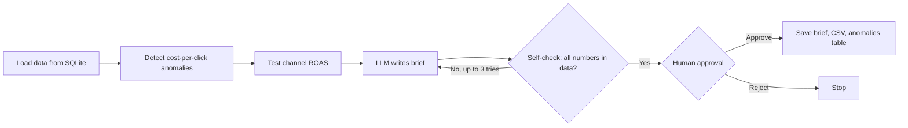

# Marketing Campaign Auditor Agent

An AI agent that reviews daily ad spending across marketing channels, uses statistical tests to flag channels that lose money or show unusual cost spikes, writes a budget recommendation brief, checks its own brief for invented numbers, and waits for human approval before saving anything.

## How It Works

The key design choice is that **all statistics run in Python, and the LLM only writes.** Language models are unreliable at reading p-values and doing arithmetic, so every statistical decision is made in code and passed to the model as plain facts.

## Statistical Methods

| Check | Method | Why |
|---|---|---|
| Cost spikes | Robust z-score (median and MAD) of daily cost per click against the prior 28 days, threshold 3.5 | Median and MAD are not distorted by the spikes being detected |
| Channels losing money | One-sided t-test of daily ROAS against 1, at p < 0.05, with a 95% confidence interval | Separates a channel that consistently loses money from a few bad days |
| Channel differences | Kruskal-Wallis test | ROAS variances differ widely across channels, which violates ANOVA's equal-variance assumption |

ROAS (return on ad spend) is revenue divided by spend. A ROAS below 1 means a channel brings in less than it costs.

## Data

The data is **simulated** by `generate_data.py`, since real company ad spending data is confidential. It covers 90 days across four channels (Paid Search, Social, Display, Email) with two problems planted on purpose to test the agent:

1. **Display loses money**, with a ROAS below 1.
2. **Social's spend jumps 2.5x** in the last five days with no increase in clicks.

## Results

The agent caught both planted problems:

| Channel | Spend | Revenue | Mean Daily ROAS | 95% CI | Losing Money |
|---|---|---|---|---|---|
| Display | $26,775 | $22,719 | 0.84 | 0.74 to 0.94 | Yes (p = 0.0015) |
| Email | $8,734 | $102,790 | 11.80 | 11.14 to 12.46 | No |
| Paid Search | $44,986 | $139,764 | 3.10 | 2.90 to 3.29 | No |
| Social | $38,547 | $61,128 | 1.66 | 1.51 to 1.81 | No |

- **5 anomalies detected**, all Social, on the final five days, with cost per click rising from about $1.00 to between $2.37 and $2.68.
- **Approved recommendation:** move budget away from Display, avoid adding budget to Social until the cost spike is explained, and favor Email and Paid Search, the two highest-ROAS channels.

## What I Learned Building It

Early versions of the brief had errors that the human approval step caught:

- The model read a p-value of 1.0 as "significantly losing money" and flagged three profitable channels while missing Display. **Fix:** the significance decision moved into Python as a simple true/false `losing_money` flag.
- The model invented budget percentages (20%, 15%) that were not in the data. **Fix:** a self-check step extracts every number from the brief, rejects any that do not appear in the data, and sends the brief back for a rewrite with feedback.
- The model's instructions were being cut off by the default context window, so it described the data format instead of writing a brief. **Fix:** a larger context window and instructions placed after the data.

## Tools

- **Python:** pandas, NumPy, SciPy
- **LangGraph:** workflow with a self-check loop and a human approval gate
- **Ollama with Llama 3.1:** runs the language model locally, with no API costs and no data leaving the machine
- **SQLite:** stores daily spend data and detected anomalies

## Files

| File | Description |
|---|---|
| `generate_data.py` | Creates the simulated data in `marketing.db` |
| `tools.py` | Anomaly detection and channel statistics |
| `agent.py` | LangGraph workflow, LLM brief, self-check, and approval gate |
| `requirements.txt` | Python dependencies |
| `audit_brief.md` | Approved brief from the final run |
| `channel_summary.csv` | Channel statistics, ready for Tableau |

## How to Run

1. Install [Ollama](https://ollama.com) and download the model: `ollama pull llama3.1`
2. Install dependencies: `pip install -r requirements.txt`
3. Create the data: `python generate_data.py`
4. Run the agent: `python agent.py`

## Limitations

- The data is simulated, so results show the method works, not findings about a real business.
- The t-test treats each day as independent, but daily marketing results are often correlated over time.
- The self-check catches invented numbers but not wording errors, which is why the human approval step remains.
- A small local model writes simpler briefs than larger hosted models.
